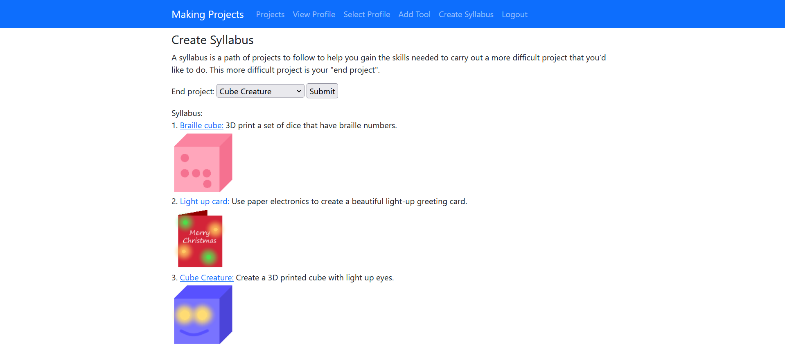

# Making Projects

[![Python v.3.8][Python]][Python-url]
[![Django v.4.1][Django]][Django-url]
[![SQLite v.3.41][SQLite]][SQLite-url]
[![Bootstrap v.5.2][Bootstrap.com]][Bootstrap-url] 

A Django web app for tangible learning project tutorials in a format more accessible to people with intellectual disabilities, along with customised syllabuses of tutorials.



Tested on Windows 11. Hosted version available: https://ciw.eu.pythonanywhere.com/

____________________________________
## Build Instructions
How to start running a local version of Making Projects. 

### Prerequisites 
* Python 3.8
* pip

### Build Steps 
It is advised to use a virtual environment. 

1. Clone the repository
``` ssh
git clone https://github.com/ci-w/IndividualProject.git
```
2. Navigate to src directory
```
cd src
```

3. Use pip to install packages

```
pip install -r requirements.txt
``` 
4. Generate a Django secret key (50 random characters) at https://djecrety.ir/ (alternative: https://django-secret-key-generator.netlify.app/)
5. Create a file named `.env` in the src directory
6. Write within it, where `key_here` is your secret key
```
export SECRET_KEY='key_here'
```
7. To run local development server (127.0.0.1:8000/)
```
python manage.py runserver
```
____________________________________
## Features
* **User profiles**: users specify (and can update) their current skill levels, which are common areas that people with intellectual disabilities struggle with in relation to tangible learning. 
* **Accounts**: user account functionality for storage of those individual requirements, multiple profiles to one account is allowed.
* **Project tutorials**: contains some dummy project tutorials. Stored as Django models with a structure similar to the user skill levels reflecting what skills and materials each project requires. Each tutorial page specifies if it's currently suitable for the user.
* **Syllabus**: user specifies a project they want to do, and a list of project tutorials is created that bridges the gap between their current skill levels and that of the selected project.
* **Admin interface**: customised admin interface to allow for easy access of project tutorials and user information.

____________________________________

[Bootstrap.com]: https://img.shields.io/badge/Bootstrap-5.2-blue?style=flat-square&logo=bootstrap&amp;logoColor=fff
[Bootstrap-url]: https://getbootstrap.com
[Python]: https://img.shields.io/badge/python-3.8-blue?style=flat-square&logo=python&amp;logoColor=fff 
[Python-url]: https://www.python.org/
[Django]: https://img.shields.io/badge/Django-4.1-blue?style=flat-square&logo=django&amp;logoColor=fff
[Django-url]: https://www.djangoproject.com/
[SQLite]: https://img.shields.io/badge/SQLite-3.41-blue?style=flat-square&logo=sqlite&amp;logoColor=fff
[SQLite-url]: https://www.sqlite.org
